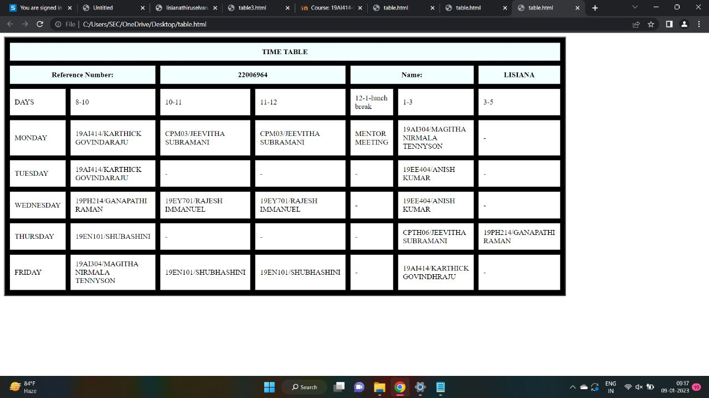

# Experiment_Time_Table

## AIM
To Write a html webpage page to display your timetable.

# ALGORITHM
### STEP 1
create a simple table using table tag
### STEP 2
Add header row using th tag
### STEP 3
Add your timetable
### STEP 4
Execute the program

# CODE
```
<TABLE BORDER="3" width="750" bgcolor="BLACK" cellspacing="10" cellpadding="10"> 
<TR> 
	<TH colspan="9" align="center" bgcolor="azure">TIME TABLE</TH>
</TR>   
<TR> 
	<TH colspan="2" width="25%" bgcolor="azure">Reference Number:</TH>
     <TH colspan="2" width="25%" bgcolor="azure">22006964</TH>
     <TH colspan="2" width="25%" bgcolor="azure">Name:</TH>
     <TH colspan="2" width="25%" bgcolor="azure">LISIANA</TH> 
</TR>
<TR>
	<TD width="25%" bgcolor="white">DAYS</TD>
      <TD width="25%" bgcolor="white">8-10</TD> 
	<TD width="25%" bgcolor="white">10-11</TD>
	<TD width="25%" bgcolor="white">11-12</TD>
     <TD width="25%" bgcolor="white">12-1-lunch break</TD>
     <TD width="25%" bgcolor="white">1-3</TD>
     <TD width="25%" bgcolor="white">3-5</TD>
</TR>
<TR>
     <TD width="25%" bgcolor="white">MONDAY</TD>
     <TD width="25%" bgcolor="white">19AI414/KARTHICK GOVINDARAJU</TD>
     <TD width="25%" bgcolor="white">CPM03/JEEVITHA SUBRAMANI</TD>
     <TD width="25%" bgcolor="white">CPM03/JEEVITHA SUBRAMANI</TD>
     <TD width="25%" bgcolor="white">MENTOR MEETING</TD>
     <TD width="25%" bgcolor="white">19AI304/MAGITHA NIRMALA TENNYSON</TD>
     <TD width="25%" bgcolor="white">-</TD>
</TR> 
<TR>
     <TD width="25%" bgcolor="white">TUESDAY</TD>
     <TD width="25%" bgcolor="white">19AI414/KARTHICK GOVINDARAJU</TD>
     <TD width="25%" bgcolor="white">-</TD>
     <TD width="25%" bgcolor="white">-</TD>
     <TD width="25%" bgcolor="white">-</TD>
     <TD width="25%" bgcolor="white">19EE404/ANISH KUMAR</TD>
     <TD width="25%" bgcolor="white">-</TD>
</TR>
<TR>
     <TD width="25%" bgcolor="white">WEDNESDAY</TD>
     <TD width="25%" bgcolor="white">19PH214/GANAPATHI RAMAN</TD>
     <TD width="25%" bgcolor="white">19EY701/RAJESH IMMANUEL</TD>
     <TD width="25%" bgcolor="white">19EY701/RAJESH IMMANUEL</TD>
     <TD width="25%" bgcolor="white">-</TD>
     <TD width="25%" bgcolor="white">19EE404/ANISH KUMAR</TD>
     <TD width="25%" bgcolor="white">-</TD>
</TR>
<TR>
     <TD width="25%" bgcolor="white">THURSDAY</TD>
     <TD width="25%" bgcolor="white">19EN101/SHUBASHINI</TD>
     <TD width="25%" bgcolor="white">-</TD>
     <TD width="25%" bgcolor="white">-</TD>
     <TD width="25%" bgcolor="white">-</TD>
     <TD width="25%" bgcolor="white">CPTH06/JEEVITHA SUBRAMANI</TD>
     <TD width="25%" bgcolor="white">19PH214/GANAPATHI RAMAN</TD>
</TR>
<TR>
     <TD width="25%" bgcolor="white">FRIDAY</TD>
     <TD width="25%" bgcolor="white">19AI304/MAGITHA NIRMALA TENNYSON</TD>
     <TD width="25%" bgcolor="white">19EN101/SHUBHASHINI</TD>
     <TD width="25%" bgcolor="white">19EN101/SHUBHASHINI</TD>
     <TD width="25%" bgcolor="white">-</TD>
     <TD width="25%" bgcolor="white">19AI414/KARTHICK GOVINDHRAJU</TD>
     <TD width="25%" bgcolor="white">-</TD>
</TR>
</TABLE>
```
# OUPUT
